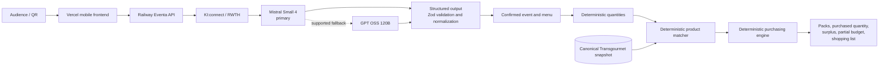

# Eventa.

## Event in a Box

Eventa turns an unstructured catering brief into a structured event plan, a professional menu, ingredient quantities, matched Transgourmet products, a purchasing budget, and a grouped shopping list.

Built for **BÄRNHÄCKT 2026 / the Transgourmet challenge**. Eventa is a hackathon prototype, not an official production Transgourmet product.

- **Live demo:** [eventa-five.vercel.app](https://eventa-five.vercel.app)
- **Backend health:** [Railway Eventa API](https://eventa-production-3df2.up.railway.app/api/health)

## Why Eventa

Catering planning is fragmented across conversations, menus, dietary notes, spreadsheets, catalogue searches, pack calculations, and budget checks. Eventa connects those steps in one inspectable pipeline:

```text
Free-text event request
→ KI:connect event interpretation
→ AI menu generation
→ deterministic quantities
→ deterministic Transgourmet product matching
→ deterministic pack and purchasing calculation
→ partial or complete budget
→ grouped shopping list
```

The technical principle is deliberately strict:

> **AI reasons. Eventa calculates. Transgourmet data provides product facts.**

AI handles language and menu planning. Deterministic TypeScript owns dietary serving allocation, unit conversion, ingredient totals, product ranking, pack counts, purchased quantity, surplus, pricing arithmetic, budgets, and shopping-list construction.

## Architecture



The backend exposes each stage independently rather than hiding the planning process behind one opaque call.

## AI provider

Eventa has one production provider family: **KI:connect (RWTH / KI:connect NRW)** through its OpenAI-compatible Chat Completions API.

- Primary model: `mistralai-mistral-small-4-119b`
- Fallback model: `gpt-oss-120b`

Mistral Small 4 was selected because it benchmarked substantially faster for Eventa's structured interpretation and menu workload while satisfying both schemas and menu policy. GPT OSS is retained for supported transient transport failures and schema/policy failures that remain after corrective regeneration. Permanent authentication and request errors are not masked by fallback.

AI output is untrusted until strict Zod parsing, normalization, stable-ID generation, and Eventa menu-policy validation complete.

## Implemented backend capabilities

| Method | Endpoint | Responsibility |
|---|---|---|
| `GET` | `/api/health` | Liveness and safe KI:connect configuration status |
| `POST` | `/api/interpret-event` | Brief → validated event facts |
| `POST` | `/api/generate-menu` | Confirmed event → validated catering menu |
| `POST` | `/api/calculate-quantities` | Deterministic allocations and ingredient requirements |
| `POST` | `/api/match-products` | Deterministic canonical-product ranking and selection |
| `POST` | `/api/create-purchasing-plan` | Deterministic packs, purchasing, partial budget, and shopping list |

Partial results are intentional:

- unknown or overlapping dietary allocations become `needs_confirmation`;
- an unresolved product remains unresolved rather than receiving an invented match;
- a missing verified price produces an unpriced line and a partial budget;
- one unresolved line never erases otherwise valid quantities, matches, or totals.

This release branch contains the deployed mobile frontend and the complete backend planning pipeline in one repository.

## Transgourmet catalogue snapshot

The canonical hackathon dataset contains **392 unique article numbers** assembled from a manually supplied seed and official, publicly accessible Transgourmet Switzerland documents and product/catalogue pages.

- 261 `verified_public_source`
- 22 officially identified products with price still unverified
- 283 products with official public identity evidence across those two statuses
- 3 partial public-source records
- 106 seed-unverified records
- 172 populated prices: 60 from public-source evidence and 112 retained from seed provenance
- 2 unresolved pack/sales-unit conflicts

Eventa did not authenticate to, bypass, or scrape a protected webshop. Provenance is preserved and missing product facts or prices remain missing. This is a time-bounded hackathon snapshot, not a live complete catalogue or stock feed.

## Tech stack

- React 19, TypeScript, Vite, React Router, CSS Modules
- Node.js TypeScript HTTP API
- KI:connect OpenAI-compatible Chat Completions
- Zod runtime validation
- Vitest, ESLint, strict TypeScript
- Vercel frontend and Railway backend

## Local development

```powershell
npm install
Copy-Item .env.example .env.local
npm run dev
```

Configure `.env.local` with your own server-side KI:connect credential:

```dotenv
KICONNECT_API_KEY=your_kiconnect_api_key
KICONNECT_BASE_URL=https://chat.kiconnect.nrw/api/v1
KICONNECT_MODEL=mistralai-mistral-small-4-119b
KICONNECT_FALLBACK_MODEL=gpt-oss-120b
```

Local defaults are `http://localhost:5173` for Vite and port `8787` for the API. Vite proxies relative `/api` requests locally.

## Production configuration

Vercel frontend:

```dotenv
VITE_API_BASE_URL=https://eventa-production-3df2.up.railway.app
```

Railway backend:

```dotenv
KICONNECT_API_KEY=your_kiconnect_api_key
KICONNECT_BASE_URL=https://chat.kiconnect.nrw/api/v1
KICONNECT_MODEL=mistralai-mistral-small-4-119b
KICONNECT_FALLBACK_MODEL=gpt-oss-120b
FRONTEND_ORIGIN=https://eventa-five.vercel.app
```

Railway supplies `PORT`; Eventa falls back to `EVENTA_API_PORT`, then `8787`, and binds to `0.0.0.0`.

## Security

- `KICONNECT_API_KEY` is server-side only. Never expose it through a `VITE_*` variable.
- `.env`, `.env.local`, and `.env.*` are ignored; only the placeholder `.env.example` is tracked.
- Requests and provider output are runtime-validated.
- Public errors omit provider payloads, stack traces, and secrets.
- Request-scoped logs contain correlation and timing metadata, not prompts or credentials.
- Production CORS reflects only the configured frontend origin; it never uses `*`.

## Repository structure

```text
src/                    React application
server/api/             HTTP route handlers
server/ai/              KI:connect provider, fallback, retry, cache boundary
server/quantities/      Deterministic allocation and quantity engine
server/products/        Canonical catalogue loader and matcher
server/purchasing/      Pack, budget, and shopping-list engine
server/schemas/         Zod trust-boundary schemas
shared/                 Cross-layer TypeScript contracts
data/                   Canonical catalogue and provenance inputs
scripts/                Dataset pipeline and validation
docs/                   Architecture, API, report, runbook, and data notes
```

## Verification

```powershell
npm run lint
npm run typecheck
npm test
npm run build
npm run verify:quantities
npm run verify:products
npx tsx scripts/validate-products.ts
```

The quantity, product, and dataset checks are deterministic and consume no provider quota. `verify:ai`, `verify:menus`, `verify:flow-reliability`, `verify:kiconnect-*`, `verify:purchasing`, and benchmark scripts call KI:connect and should be run deliberately.

## Known limitations

- The catalogue snapshot is incomplete and is not a live Transgourmet API, price feed, or stock system.
- Price coverage is partial, so some budgets remain partial and are not procurement quotes.
- Unknown dietary overlap and low-confidence product matches require review.
- KI:connect remains an external dependency subject to latency, availability, and quota limits.
- AI cache and backend state are process-local; there is no persistent plan database.
- The prototype has no authentication, checkout, order submission, or official Transgourmet ordering integration.

## Documentation

- [Architecture](docs/ARCHITECTURE.md)
- [Technical report](docs/TECHNICAL_REPORT.md)
- [API contracts](docs/API.md)
- [Dataset provenance](docs/TRANSGOURMET_DATASET.md)
- [Demo runbook](docs/DEMO_RUNBOOK.md)
- [Documentation index](docs/README.md)
- [Historical backend audit](docs/backend-audit.md)
