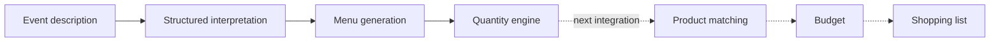
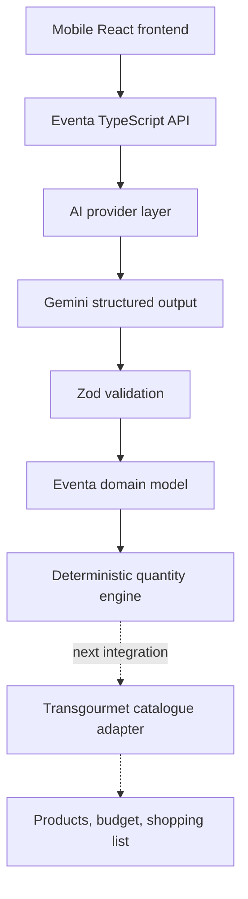
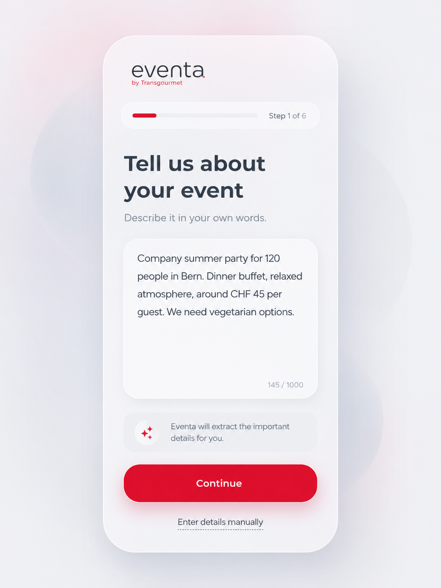
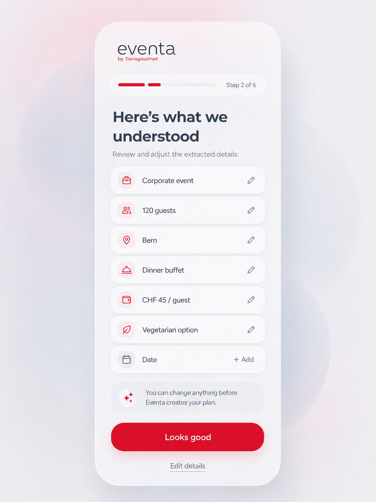
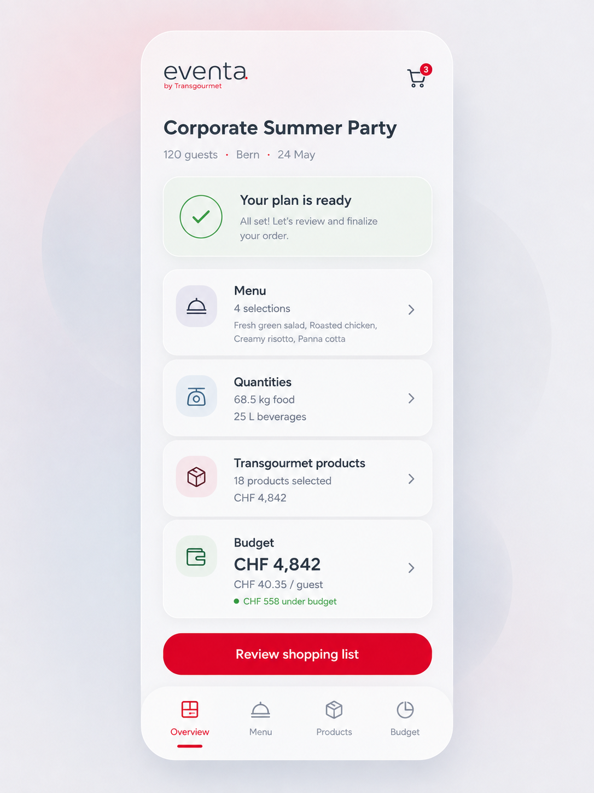

# eventa.

Mobile-first, AI-assisted event and catering planning that turns a natural-language brief into a structured, explainable plan.

*Hackathon prototype for the Transgourmet / Prodega challenge.*

## The problem

Professional event and catering planning requires translating a brief into a menu, dietary requirements, quantities, purchasable products, a budget, and a shopping list. Today, those steps are often fragmented across conversations, spreadsheets, manual calculations, and catalogue searches.

## The solution

eventa. creates a guided planning pipeline:

**Natural-language event brief → AI interpretation → catering menu → deterministic quantities → Transgourmet product matching → pack quantities → budget → shopping list**

The current prototype implements event interpretation, editable structured event details, validated menu generation, and a deterministic quantity API. Product matching, package calculations, budget totals, and shopping-list generation are the next integration stage; the UI labels these steps as pending rather than displaying fabricated values.

## Demo flow



## Key technical idea

eventa. deliberately separates probabilistic AI work from deterministic domain logic.

| AI / probabilistic | Deterministic |
|---|---|
| Understand natural language | Allocate known dietary servings |
| Propose an appropriate catering menu | Calculate ingredient quantities |
| Recommend per-serving portions | Normalize units |
| | Future pack and price calculations |

AI is useful for interpretation and planning, but it is not trusted with arithmetic. This boundary makes results more reliable, transparent, explainable, and straightforward to test.

## Architecture



## Current capabilities

- ✅ Natural-language event interpretation
- ✅ Explicit dietary guest counts, including an honest “unknown” state
- ✅ Editable interpretation before menu generation
- ✅ AI-generated, structured catering menus
- ✅ Stable Eventa-generated menu item IDs
- ✅ Deterministic serving and ingredient quantity calculation API
- ✅ Unit normalization to grams, millilitres, and pieces
- ✅ Partial quantity plans when information is missing or ambiguous
- ✅ Mobile-first event brief, interpretation, plan overview, and menu routes
- ◻️ Quantity results are not yet connected to the frontend
- ◻️ Transgourmet product matching, packs, budget, and shopping list are pending

## Reliability / engineering

- Gemini API key remains server-side.
- Gemini JSON schemas guide structured output; strict Zod schemas validate requests and responses.
- Transport retries handle 429, 503, timeout, and transient network failures with bounded attempts, backoff, jitter, and `Retry-After` support.
- Schema/policy corrective regeneration is separate from network retry.
- Identical in-flight AI requests are deduplicated; successful results use a short-lived bounded in-memory cache.
- Request IDs, safe typed errors, structured logs, and operation timings support traceability.
- Quantity ambiguity is explicit: unknown or overlapping dietary groups produce partial results requiring confirmation.
- Strict TypeScript and Vitest cover schemas, normalization, AI resilience, and deterministic calculations.

## UI concept

<p align="center">
  
  
  
</p>

These are design references. The implemented prototype honestly marks unconnected planning stages as pending.

## Tech stack

**Frontend:** React 19, TypeScript, Vite, React Router, CSS Modules, Lucide icons  
**Backend:** Node.js, TypeScript, `@google/genai`, Zod  
**Testing:** Vitest, ESLint, strict TypeScript checks

## Running locally

```powershell
npm install
Copy-Item .env.example .env.local
npm run dev
```

Add your own Gemini key to `.env.local`, then open the Vite URL printed in the terminal—normally `http://localhost:5173`. Vite proxies `/api` to the local API on port `8787`.

## Environment

```dotenv
GEMINI_API_KEY=your_gemini_api_key
GEMINI_MODEL=gemini-3.7-flash
EVENTA_AI_CACHE_ENABLED=true
```

`GEMINI_MODEL` is optional and the in-memory demo cache can be disabled with `EVENTA_AI_CACHE_ENABLED=false`.

## Repository structure

```text
src/                    React application, features, services, and UI components
server/api/             HTTP route handlers
server/ai/              AI provider boundary, Gemini adapter, and resilience
server/schemas/         Zod request and structured-output schemas
server/quantities/      Deterministic allocation and unit conversion
shared/                 Frontend/backend TypeScript domain contracts
docs/design-reference/  Authoritative UI concept references
```

## Testing

```powershell
npm run lint
npm run typecheck
npm test
npm run build
```

Optional live and deterministic verification scripts are available as `verify:ai`, `verify:menus`, `verify:flow-reliability`, and `verify:quantities`. Live Gemini checks consume provider quota.

## Security note

The Gemini key is server-only. `.env.local` is ignored by Git, and no secret or personal data should be committed. API errors sent to the browser exclude provider internals and stack traces.

## Hackathon scope

eventa. is a hackathon prototype, not an official production Transgourmet / Prodega product. Product matching is designed around a curated Transgourmet dataset or adapter for the prototype; that boundary can later be replaced with an official catalogue/API integration if available.

## Team

Team details: _add hackathon team member names and roles before submission._
