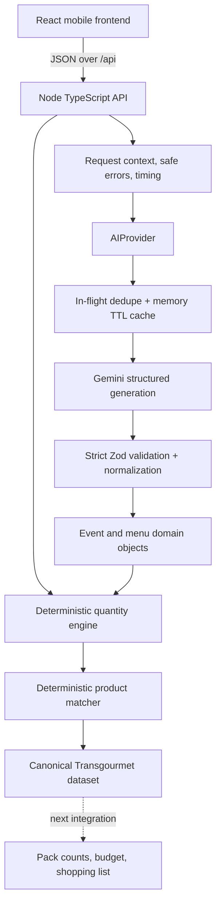
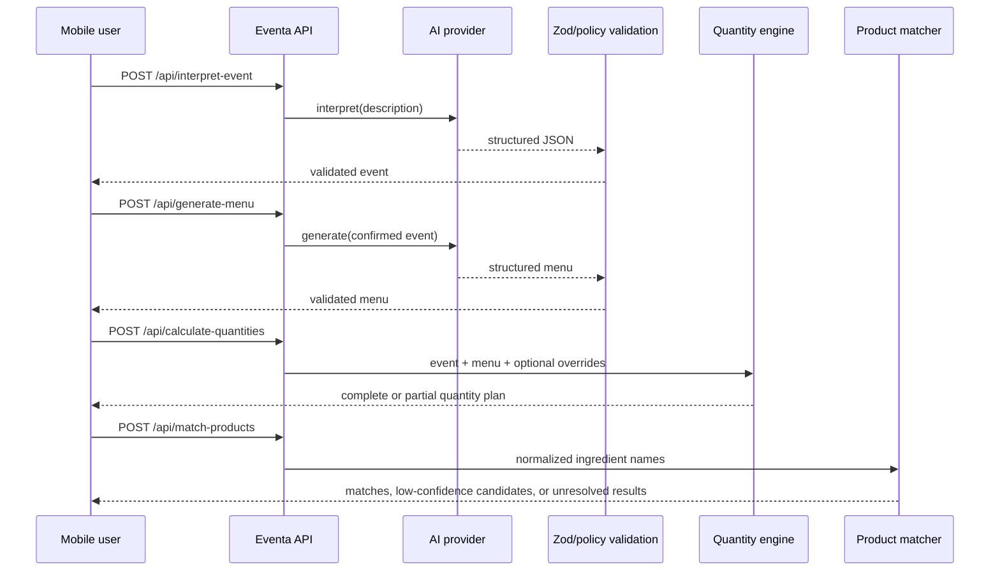

# Eventa Architecture

## System diagram

Solid lines are implemented. Dotted lines are future integrations.

## Request flow

## AI versus deterministic responsibility

| Responsibility | AI | Deterministic domain |
|---|:---:|:---:|
| Interpret free-text event facts | ✓ | |
| Propose menu and per-serving ingredients | ✓ | |
| Validate types, bounds, and policy | | ✓ |
| Allocate dietary servings | | ✓ |
| Detect unknown/overlapping audiences | | ✓ |
| Convert and aggregate quantities | | ✓ |
| Match products | | Yes |
| Calculate packs, prices, and budget | | Future |

## Implemented API endpoints

| Method | Endpoint | Purpose |
|---|---|---|
| `GET` | `/api/health` | Safe liveness and AI-configuration status |
| `POST` | `/api/interpret-event` | Validate a brief and return structured event facts |
| `POST` | `/api/generate-menu` | Generate and validate a catering menu |
| `POST` | `/api/calculate-quantities` | Return deterministic serving and ingredient quantities |
| `POST` | `/api/match-products` | Rank canonical products for ingredient names without AI |

All other API paths return a typed `NOT_FOUND` response.

## Main domain objects

- `EventInterpretation`: nullable event facts, budgets, dietary requirements, and notes.
- `DietaryRequirement`: normalized `type` plus explicit or unknown `guestCount`.
- `EventMenu`: title, summary, menu items, and transparent planning assumptions.
- `MenuItem`: stable ID, course, tags, portion, per-serving ingredients, and serving scope.
- `QuantityPlan`: item allocations, canonical ingredient requirements, unresolved decisions, completion state, and assumptions.
- `ProductMatchPlan`: deterministic selected products, low-confidence candidates, alternatives, reasons, and unresolved ingredients.

## Security boundaries

- Browser code never receives the Gemini key; the provider runs server-side.
- HTTP request bodies are size-bounded and Zod-validated.
- Gemini output is untrusted until strict validation and normalization complete.
- Public error payloads contain safe codes/messages, not stack traces or provider internals.
- Request logs contain correlation metadata, not prompts, bodies, AI output, or environment values.
- `.env.local` and other environment files are ignored except the placeholder `.env.example`.
- The public QR flow intentionally has no authentication and no persistent prompt storage.

## Current and future integrations

| Integration | Status |
|---|---|
| Gemini through `@google/genai` | Implemented |
| KI:connect through its OpenAI-compatible Chat Completions API | Implemented; Mistral Small 4 primary with GPT OSS fallback |
| Model-agnostic `AIProvider` boundary | Implemented |
| In-memory cache and identical-request deduplication | Implemented, hackathon scale |
| Deterministic quantity service | Implemented API; frontend connection pending |
| Canonical Transgourmet dataset loader and deterministic matcher | Implemented API; frontend connection pending |
| Pack and price calculation | Not implemented |
| Budget and shopping list | Not implemented |
| Checkout/order submission | Not implemented |
