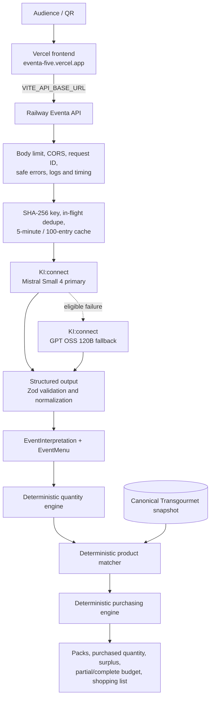
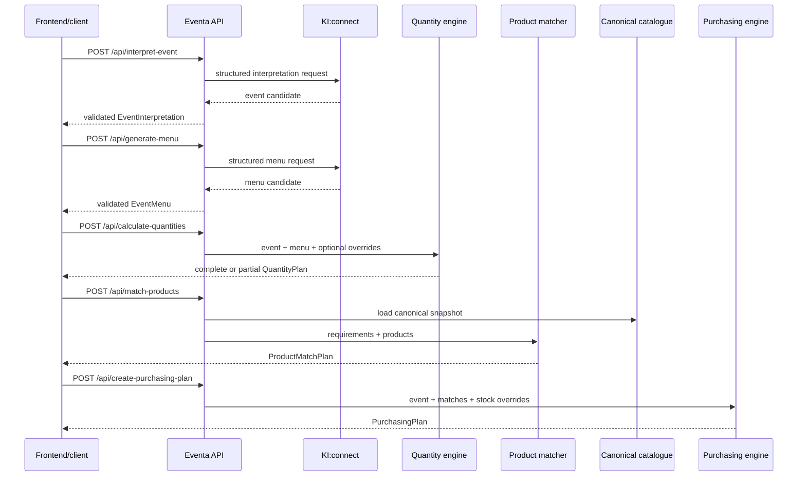

# Eventa architecture

## Architectural principle

> **AI reasons. Eventa calculates. Transgourmet data provides product facts.**

KI:connect performs probabilistic language interpretation and menu planning. It may recommend per-serving ingredient amounts, but it never owns authoritative event totals, product facts, product selection scores, packs, purchased quantity, surplus, prices, budgets, or shopping-list arithmetic.

## Production topology



The integrated release branch contains both the deployed frontend source and every backend API it consumes.

## Request sequence



The server exposes stages independently. Each response can be inspected, confirmed, retried, or passed to the next endpoint.

## KI:connect provider boundary

`AIProvider` defines `interpret` and `generate`. The runtime always constructs the KI:connect family when `KICONNECT_API_KEY` is configured; no provider selector is required.

Configuration defaults:

- base URL: `https://chat.kiconnect.nrw/api/v1`
- primary: `mistralai-mistral-small-4-119b`
- fallback: `gpt-oss-120b`

The provider uses OpenAI-compatible `/chat/completions` with JSON Schema structured output. Each transport has up to three bounded attempts. HTTP 429, 503, 408/504, timeouts, and eligible network/server errors can retry; `Retry-After` is respected when present. Authentication and permanent request errors do not retry or trigger model fallback.

Schema/policy correction is distinct from transport recovery. Eventa permits one corrective regeneration. If Mistral still exhausts an eligible transient or validation failure, the same operation is attempted with GPT OSS. The fallback does not hide permanent configuration errors.

Both models are wrapped by:

- normalized SHA-256 request keys;
- identical-request in-flight deduplication;
- a five-minute, 100-entry successful-result cache;
- `EVENTA_AI_CACHE_ENABLED=false` as an escape hatch.

The cache is process-local and not a persistence layer.

## Validation boundary

Provider output is untrusted until it passes:

1. strict structured JSON parsing;
2. Zod schema validation;
3. normalization;
4. stable Eventa menu-ID generation;
5. menu planning-policy validation.

Missing event facts remain `null` or `[]`. Dietary guest counts are retained only when explicitly stated. Menu ingredient amounts are recommendations per serving, never multiplied event totals.

## Deterministic domains

### Quantities

- `all_guests` normally uses total attendance.
- A known, unambiguous dietary alternative reduces the corresponding standard course deterministically.
- `dietary_option` uses an explicitly known compatible dietary count.
- Unknown counts or possible group overlap become `needs_confirmation`.
- `shared` uses total attendance.
- Valid serving overrides take precedence.
- `g`/`kg`, `ml`/`l`, and compatible count units normalize to `g`, `ml`, and `piece`.
- Ingredients aggregate only by normalized name and compatible dimension.
- Missing quantities remain unresolved; no hidden catering buffer is added.

### Product matching

The matcher loads `data/transgourmet-products.canonical.csv` and ranks candidates using normalized name evidence, category/subcategory hints, keyword overlap, verification, available price evidence, and conflict penalties. Only safe matches receive `selectedProduct`; lower-confidence results retain alternatives and reasons.

### Purchasing

For compatible validated pack metadata:

```text
packs              = ceil(required amount / canonical pack amount)
purchased quantity = packs × canonical pack amount
surplus             = purchased quantity − required amount
```

Supported price bases are `per_pack`, `per_kg`, `per_liter`, and `per_piece` when compatible. Missing pack or price facts remain explicit. Known subtotals exclude already-in-stock lines. Total budget is never derived from a per-guest target. Lines are grouped into purchasing categories without removing unresolved entries.

## API and domain objects

| Method | Endpoint | Response |
|---|---|---|
| `GET` | `/api/health` | liveness and KI:connect configuration state |
| `POST` | `/api/interpret-event` | `EventInterpretation` |
| `POST` | `/api/generate-menu` | `EventMenu` |
| `POST` | `/api/calculate-quantities` | `QuantityPlan` |
| `POST` | `/api/match-products` | `ProductMatchPlan` |
| `POST` | `/api/create-purchasing-plan` | `PurchasingPlan` |

- `EventInterpretation`: nullable event facts, explicit budgets, dietary counts, and notes.
- `EventMenu`: stable menu items, scopes, dietary audience, portions, and per-serving ingredients.
- `QuantityPlan`: allocations, canonical requirements, unresolved decisions, and completeness.
- `ProductMatchPlan`: selected products or null, confidence, alternatives, reasons, and summary.
- `PurchasingPlan`: pack lines, purchase amounts, surplus, partial budget, grouped list, and stock flags.

See [API.md](API.md) for field-level contracts.

## Data and security boundaries

- `KICONNECT_API_KEY` is server-only and never belongs in a `VITE_*` variable.
- `VITE_API_BASE_URL` is a public Vercel build-time URL, not a secret.
- Request bodies are capped at 256 KiB and Zod-validated.
- Public errors use a typed safe envelope and omit provider details and stacks.
- Logs contain request IDs, timing, retry category, and model fallback metadata—not prompts, output, headers, keys, or environment dumps.
- Railway supplies `PORT`; Eventa falls back to `EVENTA_API_PORT`, then `8787`, and binds to `0.0.0.0`.
- CORS reflects only `FRONTEND_ORIGIN` or local Vite origins and handles preflight with 204.
- The canonical catalogue is a checked-in snapshot, not authenticated API access.

## Capability boundaries

| Capability | Status |
|---|---|
| Interpretation and menu generation | Implemented via KI:connect |
| Quantities and serving overrides | Implemented deterministically |
| Product matching and alternatives | Implemented deterministically |
| Packs, purchasing, partial budget, shopping list | Implemented deterministically |
| Deployed frontend pipeline | Implemented in this release branch / Vercel |
| Live official catalogue, prices, or stock | Not implemented |
| Authentication and persistent plans | Not implemented |
| Checkout or order submission | Not implemented |
